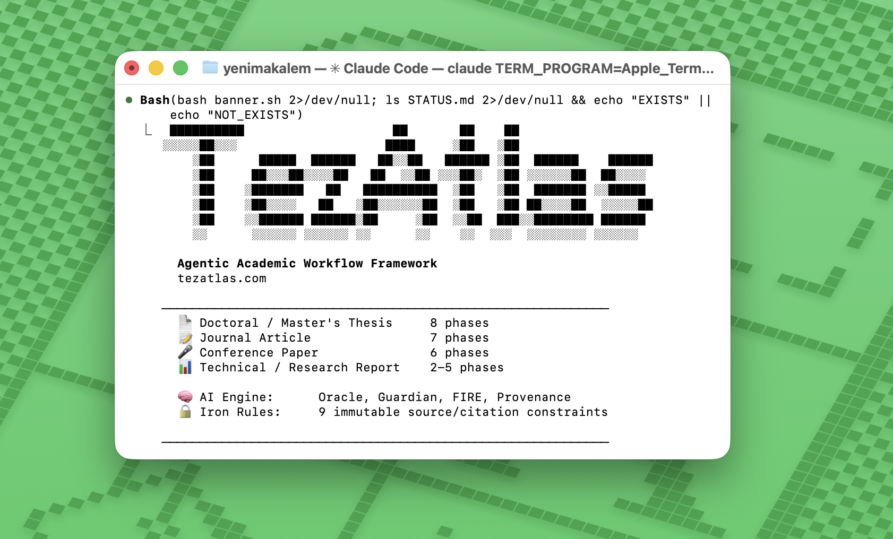

<div align="center">

# TezAtlas

### Agentic Academic Workflow Framework

*[tezatlas.com](https://tezatlas.com)*

[](LICENSE)
[]()
[]()

<br/>



</div>

---

> **AI writing tools hallucinate citations. Papers that don't exist. Authors who never wrote them. Page numbers from nowhere.**
>
> TezAtlas can't. Iron Rule 1 makes citation fabrication structurally impossible — not by warning, not by prompt, but by hard constraint: no sentence is written, no citation is made, without a physical source file on disk.

---

## Table of Contents

1. [What is TezAtlas?](#1-what-is-tezatlas)
2. [Supported Document Types](#2-supported-document-types)
3. [Quick Start](#3-quick-start)
4. [The 9 Iron Rules](#4-the-9-iron-rules)
5. [Phase Architecture](#5-phase-architecture)
6. [The Two Modes: Research Copilot & Thought Partner](#6-the-two-modes)
7. [OCR Pipeline](#7-ocr-pipeline)
8. [Multi-Agent System](#8-multi-agent-system)
9. [Paragraph Coherence Engine](#9-paragraph-coherence-engine)
10. [Natural Voice System](#10-natural-voice-system)
11. [Academic Research Foundation](#11-academic-research-foundation)
12. [Skill Graph Architecture](#12-skill-graph-architecture)
13. [Discipline Modules](#13-discipline-modules)
14. [Session Workflow & Wellbeing](#14-session-workflow--wellbeing)
15. [Intelligence & Integrity Layer](#15-intelligence--integrity-layer)
16. [Literature Intelligence & Slash Commands](#16-literature-intelligence--slash-commands)
17. [LaTeX Pipeline & PDF Output](#17-latex-pipeline--pdf-output)
18. [How TezAtlas Teaches Academic Writing](#18-how-tezatlas-teaches-academic-writing)
19. [Universal CLI & Multi-AI Support](#19-universal-cli--multi-ai-support)
20. [Plugin System & Community Ecosystem](#20-plugin-system--community-ecosystem)
21. [tezatlas.com — Hosted Version](#21-tezatlascom--hosted-version-coming-soon)
22. [Contributing](#22-contributing)
23. [License](#23-license)
24. [About the Name](#24-about-the-name--vision)

---

## 1. What is TezAtlas?

TezAtlas is not a chatbot. It is not a search engine or a summarizer or a citation manager. It is a **workflow engine** — a structured, phase-gated, source-anchored framework for producing academic outputs with the discipline that research actually demands.

**AI writes. You guide, select, and own.**

When you sit down to write a thesis, a journal article, or a systematic review, the hardest problem is rarely the prose itself. The hard problems are structural: starting before the literature is sufficiently read, writing claims that lack source backing, skipping the feedback cycle because a deadline looms, losing version history in a crisis moment, or quietly accumulating a pile of "deferred" sources that never get addressed. TezAtlas is designed around these exact failure modes. It does not give you freedom to skip the uncomfortable steps — it makes skipping them structurally impossible.

At the heart of TezAtlas is a set of **phase gates**: checkpoints that must be passed before the next stage of work can begin. The analogy is deliberate: just as Git requires a commit before a push, and a merge before a deploy, TezAtlas requires reading saturation before writing begins, and a revision cycle before submission. Structure does not emerge from willpower alone. It emerges from systems that enforce discipline even when motivation dips. Alongside the phase gates are nine **Iron Rules** — inviolable constraints that apply to every session, every document type, and every language TezAtlas supports. These rules exist because AI-assisted academic work has specific and well-documented failure modes: hallucinated citations, unsourced claims, silent literature gaps, and abandoned version control. Each Iron Rule closes one of these gaps permanently, not as a suggestion but as a hard constraint baked into the workflow.

TezAtlas's design is not intuitive guesswork. It is backed by research: Lovitts (2001) documented 40–50% doctoral attrition rates driven by isolation and lack of structured progress visibility. Boice (1990) demonstrated empirically that daily writing in small sessions outperforms binge writing for both productivity and quality. Zimmerman (2002) formalized the self-regulated learning cycle — forethought, performance, reflection — that TezAtlas operationalizes as a pre-session ritual, active phase work, and a post-session commit-and-log. Flower and Hayes (1981) showed that expert writers plan for their reader before drafting; TezAtlas builds reader-impact prompts into every writing phase. These are not decorative references. The framework's structure derives from them.

TezAtlas operates in two modes. In **Research Copilot / Guided Writing** mode (the default for all users), the AI generates A/B draft options for every section — complete with source citations, pros/cons analysis, and an Academic Writing Note explaining why this structure fits the section type. You choose, merge, or redirect. In **Thought Partner** mode, you write every word and the AI guides, questions, scaffolds, and challenges — but never drafts. Both modes obey all nine Iron Rules. Core intellectual tasks (thesis argument, data interpretation, conclusions) are always yours — never AI-generated.

---

## 2. Supported Document Types

| Type | Phases | What makes it unique in TezAtlas |
|---|---|---|
| Doctoral / Master's Thesis | 8 | Saturation-based reading gate, empirical methodology fork, defense armor |
| Journal Article | 7 | Peer review revision cycle (Phase 7), journal selection phase, contribution claim gate |
| Conference Paper | 6 | Starts with abstract, deadline motor, presentation prep (Phase 6) |
| Literature / Systematic Review | 6 | PRISMA + PROSPERO, data extraction phase, meta-analysis path |
| Research Report | 5 | Executive summary drafted first, dissemination phase, stakeholder-aware writing |
| Book Chapter | 5 | Volume alignment gate, editor-reviewer cycle, final integration |
| Grant Proposal | 6 | Funder analysis phase, budget justification, compliance checklist |
| Research Proposal / Prospectus | 5 | Gate to thesis: approved proposal required before thesis begins |
| Poster / Extended Abstract | 2 | Extreme content compression, visual hierarchy planning before writing |
| Technical / Lab Report | 2 | Falsifiable hypothesis gate, strict reproducibility and environment tracking |

**Doctoral / Master's Thesis.** The thesis workflow is TezAtlas's most elaborated path. Eight phases govern the journey from topic crystallization to defense preparation. A saturation-based reading gate at Phase 3 means you cannot leave the reading phase until the literature is genuinely exhausted — not until you feel like moving on, but until new sources stop producing new argument nodes. Phase 3 also forks by methodology: theoretical, quantitative, qualitative, and mixed-methods each follow different reading and analysis protocols. Defense armor — a per-argument mapping of your strongest support and your strongest counter-evidence — is mandatory before the writing phase begins. Phase 8 handles committee profiling and defense presentation.

**Journal Article.** The article workflow includes a full peer review revision cycle as Phase 7, making it the only TezAtlas path that explicitly models the feedback-and-revision loop that academic publishing actually requires. It also mandates a strategic journal selection phase (Phase 0.5) before writing begins. A contribution claim gate at Phase 0 means you cannot proceed without articulating, in one sentence, what your article adds to the field that does not already exist.

**Conference Paper.** The conference workflow begins with the abstract, not the introduction. This is deliberate: conference papers are proposal-driven. You commit to a claim before you fully know the literature, then build the literature to support it. A deadline motor is embedded in the phase structure, and Phase 6 covers presentation preparation — slides, speaker notes, and anticipated questions — as a first-class deliverable, not an afterthought.

**Literature / Systematic Review.** TezAtlas's systematic review path integrates PRISMA (Preferred Reporting Items for Systematic Reviews and Meta-Analyses) and supports PROSPERO pre-registration. Phase 3 is a data extraction phase, with a structured extraction template loaded into context. The meta-analysis path branches from Phase 4 and includes statistical synthesis guidance. Every inclusion/exclusion decision is logged and attributable.

**Research Report.** The report workflow begins by drafting the executive summary before the research is conducted. This is counterintuitive but research-backed: writing the summary first forces clarity about the purpose, audience, and decision the report must enable. The rest of the report is then written to support that summary. Phase 5 enforces a dissemination strategy (executive briefings, press releases). Stakeholder-aware writing prompts are embedded throughout.

**Book Chapter.** A volume alignment gate at Phase 0 requires you to read the volume's introduction and any existing chapters before writing your own. This prevents the common failure mode of book chapters that do not fit their volumes. An editor-reviewer cycle is modeled in Phase 5, with a structured template for addressing editorial feedback and ensuring cross-chapter integration.

**Grant Proposal.** The grant workflow opens with a funder analysis phase: before a single word of the proposal is drafted, TezAtlas requires you to document the funder's priorities, past awards, and review criteria. Budget justification and compliance checklist phases are included. The workflow is structured around the RFP-to-submission pipeline, with phase gates tied to the call's stated evaluation criteria.

**Research Proposal / Prospectus.** This workflow is explicitly positioned as the gate to the thesis: an approved research proposal is required before the thesis workflow can begin. Phase structure covers problem formulation, literature scoping, methodology justification, committee alignment, and final submission. The output of this workflow is the document your committee approves — the contract that defines what your thesis will and will not do.

**Poster / Extended Abstract.** A hyper-compressed workflow focused on immediate impact. Phase 0 distills the research into a 15-word claim, and Phase 1 mandates designing the visual hierarchy (grid, charts, flow) *before* any text paragraphs are drafted.

**Technical / Lab Report.** A strictly STEM-focused workflow where empirical validation and reproducibility are paramount. Phase 0 establishes the falsifiable hypothesis or engineering objective. Phase 1 mandates exhaustive documentation of hardware, software, random seeds, and data cleaning protocols.

---

## 3. Quick Start

```bash
git clone https://github.com/tialkan/tezatlas
cd tezatlas
claude
```

Then inside Claude Code:

```
/tezatlas
```

TezAtlas will run an onboarding sequence:

1. **Document type** — select from 10 options (thesis, article, conference, lit-review, report, book-chapter, grant-proposal, research-proposal, poster, technical-report)
2. **Language** — Turkish / English / German / French / Spanish / Other
3. **Research field** — free text (e.g., "educational psychology", "structural engineering", "Ottoman history")
4. **Mode** — Research Copilot / Guided Writing (recommended) / Thought Partner
5. **Researcher type** — Institutional advisor / Independent researcher (Reviewer Mode) / Limited access (Hybrid)

Based on your selections, TezAtlas routes you to the correct Phase 0 for your document type, loads only the skill nodes relevant to that phase, and begins the guided workflow. No configuration files to edit. No environment variables to set. No API keys beyond your Claude Code subscription.

**Requirements:**

| Requirement | Notes |
|---|---|
| Claude Code | Required — TezAtlas runs inside Claude Code sessions |
| Python 3.8+ | Required for OCR pipeline and scripts |
| `tesseract-ocr` | Optional — only needed for scanned PDFs |

Install Tesseract if you work with scanned documents:

```bash
sudo apt install tesseract-ocr
# For Turkish language support:
sudo apt install tesseract-ocr-tur
# For German:
sudo apt install tesseract-ocr-deu
```

**Docker / Devcontainer (alternative):** Skip all setup with a single command:

```bash
# VS Code: Open in Dev Container (uses .devcontainer/devcontainer.json)
# Includes: Python 3.12, Tesseract tur+eng, PyMuPDF, pre-commit hooks
docker build -t tezatlas .
docker run -it --rm -v "$(pwd):/workspace" -e GEMINI_API_KEY="..." tezatlas
```

Full devcontainer documentation: [`skills/tooling/docker-devcontainer.md`](skills/tooling/docker-devcontainer.md)

---

## 4. The 9 Iron Rules

These nine rules apply to every document type, every language, and every session — without exception. They cannot be overridden by the user, by the document type, or by deadline pressure. They exist because each one closes a specific, documented failure mode in AI-assisted academic work.

**Rule 1: No Writing or Citing Without Sources.**
No sentence is written and no citation is made in any TezAtlas phase without its source physically present in the `/sources/` directory. The source must be on disk — not in a reference manager, not in a browser tab, not in memory. If a source is needed and does not exist locally: stop. Find it. Download it. Then write. Then cite. This rule eliminates the most common failure mode of AI-assisted writing: fluent sentences and plausible-looking citations built on sources that may or may not exist as described.

**Rule 2: Snowball Sampling is Mandatory.**
Every source's footnotes, endnotes, and bibliography are scanned during the reading phase. Any cited work that is relevant to an argument node must be found, evaluated, and either included or explicitly excluded with a reason. The source tree grows organically from your first sources outward — not from a single database search that was convenient to stop. This rule reflects what systematic review methodology has known for decades: a database search alone is never sufficient.

**Rule 3: AI Downloads First.**
When a source is needed and does not exist in `/sources/`, TezAtlas attempts to locate it via Anna's Archive, open-access repositories, and institutional preprint servers before asking the user to intervene. The user is contacted only when automated retrieval fails. This rule exists to keep momentum: the most common reason a researcher stops working is not lack of ideas but friction in source acquisition. Removing that friction is part of the workflow.

**Rule 4: No Fabricated Citations — Ever.**
Citations drawn from the AI's training memory are forbidden. Guessing a page number is forbidden. Assuming a source exists because it seems like it should is forbidden. Every citation must be verified against a file in `/sources/`. If a page number cannot be confirmed, it is omitted. If a source cannot be located, the claim is held until the source is found. This rule has no exceptions. Not for deadlines, not for "I'm pretty sure it said that," not for anything.

**Rule 5: Phase Gate Review Cannot Be Skipped.**
Before every phase transition, a structured review session is mandatory. This review is performed by the **AI Peer Reviewer** (Claude assumes "Senior Peer Reviewer" role and runs a structured challenge protocol) or by a human advisor — both satisfy the rule. The AI review runs automatically; human advisor review is additive. Adapted by document type: for articles it is AI review + co-author review, for reports it is AI review + client/commissioning stakeholder. Silent phase skips do not happen in TezAtlas.

**Rule 6: Mandatory Git Commit After Every Session.**
Every TezAtlas session ends with a Git commit. Not "when it feels right" or "when there's something worth saving." Every session, every time, without exception. Thesis text without version control cannot be safely revised, cannot be recovered after a crash, and cannot be audited by an advisor who wants to see the evolution of the argument. The commit is the minimum unit of academic progress.

**Rule 7: No Progress Without Action.**
Any blocker — a missing source, an unanswered methodological question, a supervisor who has not responded — is escalated immediately with a concrete action attached. No process is left suspended waiting for conditions to improve on their own. If a blocker cannot be resolved in the current session, it is logged with an owner and a deadline, and the work continues on a parallel track that does not depend on the blocked item.

**Rule 8: Defense Armor at Reading Phase Exit.**
Before the thesis workflow exits the reading phase and enters the writing phase, a defense armor map must be completed. For every major argument node in the thesis: one strongest supporting source with a two-sentence articulation of its support, and one strongest counter-source with a two-sentence response. This is not optional and it is not done later. A researcher who cannot state their strongest counter-evidence before writing is not ready to write. Defense armor is the gate.

**Rule 9: Deferred Source Pool Reviewed Before Writing.**
During the reading phase, sources that cannot be immediately processed are marked with a deferred flag. Before the writing phase begins, every deferred source is reviewed and either processed, excluded with a reason, or escalated. Writing cannot begin until the deferred pool is empty. This rule prevents the accumulation of a shadow literature — sources you know exist and have not read — that silently weakens an argument you think is fully supported.

---

## 5. Phase Architecture

### Thesis — 8 Phases

**Phase 0: Topic Crystallization and Proposal Alignment**
The thesis begins not with reading but with disciplined thinking. Phase 0 produces a one-paragraph research problem statement, a one-sentence research question, a preliminary contribution claim, and a field mapping that identifies the two or three literatures the thesis must engage. The phase gate: the research question must be approved by the supervisor before Phase 1 begins. Skipping this phase produces a thesis that sprawls; the gate makes sprawl structurally impossible.

**Phase 1: Source Acquisition and OCR**
Phase 1 is the systematic build-out of the `/sources/` library. TezAtlas runs the OCR pipeline on all incoming PDFs, flags text-extraction failures for manual review, and applies the snowball sampling protocol to every source's bibliography. The phase gate: the source library must contain at least one primary source from every major literature identified in Phase 0 before Phase 2 begins. Quantity is not the gate; coverage is.

**Phase 2: Contribution Claim and Argument Scaffolding**
Before reading begins in earnest, the argument must be scaffolded. Phase 2 produces a working thesis statement (not final, but defensible), a three-to-five-node argument map, and an initial chapter outline. This is writing before reading — deliberately. The act of articulating a claim before you have read everything forces you to recognize, during reading, exactly where your argument is challenged and where it is supported. The phase gate: supervisor approval of the argument scaffold.

**Phase 3: Systematic Reading and Saturation**
Phase 3 is the reading phase. Every source in `/sources/` is read using TezAtlas's structured note template. Notes are filed by argument node, not by source. The saturation gate is triggered when new sources stop producing new argument nodes — when the marginal yield of reading drops below the threshold. This is a judgment call with a structured protocol, not a feeling. Phase 3 also forks by methodology:

- **Theoretical** — conceptual analysis protocol, definition mapping, position genealogy
- **Quantitative** — instrument review, statistical method audit, operationalization check
- **Qualitative** — paradigm declaration, method justification, transferability criteria
- **Mixed** — integration protocol, sequential or concurrent design decision

The defense armor requirement (Iron Rule 8) is completed at Phase 3 exit before Phase 4 can begin.

**Phase 4: Detailed Outline and Chapter Planning**
The argument scaffold from Phase 2 is now revised against the completed reading. Phase 4 produces a chapter-level outline with section headings, expected argument flow, and a source assignment — each section of the outline is pre-populated with the sources that will support it. The chapter plan is reviewed against the contribution claim: does every chapter do work toward the contribution? Any chapter that does not is either restructured or removed. Phase gate: outline approved by supervisor.

**Phase 5: First Draft**
Writing begins. In **Research Copilot / Guided Writing** mode (default), TezAtlas generates A/B draft options for each section from note files, paired with source citations and an Academic Writing Note. You select, merge, or redirect. In **Thought Partner** mode, TezAtlas prompts section by section, questioning claims and flagging unsourced sentences — but you write every word. All citations are verified against `/sources/` before being included. The ugly draft is permitted and encouraged — Iron Rule 7 ensures that perfectionism does not become a blocker.

**Phase 6: Revision and Defense Preparation**
Phase 6 is structured revision, not proofreading. TezAtlas applies the defense armor map to every chapter: are the counter-arguments addressed? Are the strongest supporting sources properly integrated? A peer revision checkpoint is included — typically a trusted colleague reads one chapter and returns structured feedback. Defense preparation produces a presentation outline, anticipated examination questions per argument node, and a response strategy for each. Phase gate: all defense armor nodes resolved.

**Phase 7: Final Review and Submission**
Final formatting, compliance check against the institution's submission requirements, a bibliography audit against `/sources/`, and the final Git commit with the submission tag. Phase 7 does not produce new writing — it verifies that all writing produced in Phases 5 and 6 meets the standards committed to in Phase 2. The submission commit is the formal artifact.

### Other Document Types — Phase Overview

| Type | Phase 0 | Phase 1 | Phase 2 | Phase 3 | Phase 4 | Phase 5 | Phase 6 | Phase 7 |
|---|---|---|---|---|---|---|---|---|
| Journal Article | Claim & Venue | Source acquisition | Argument scaffold | Systematic reading | Draft | Internal review | Peer review cycle | Final submission |
| Conference Paper | Abstract draft | Source acquisition | Argument scaffold | Focused reading | Draft | Presentation prep | — | — |
| Lit. Review | Protocol design | Database search | Screening | Data extraction | Synthesis | Draft | Final review | — |
| Research Report | Exec. summary draft | Source acquisition | Framework | Analysis | Draft | Dissemination | — | — |
| Book Chapter | Volume alignment | Source acquisition | Argument scaffold | Reading | Draft | Editor review | — | — |
| Grant Proposal | Funder analysis | Evidence base | Narrative draft | Budget | Compliance | Submission | — | — |
| Research Proposal | Problem statement | Lit. scoping | Methodology | Committee draft | Final submission | — | — | — |
| Poster | Core Claim | Visual Hierarchy | Compression | — | — | — | — | — |
| Technical Report | Hypothesis | Methodology | Results | — | — | — | — | — |

---

## 6. The Two Modes

### Mode A — Research Copilot / Guided Writing (Default)

**AI writes. You guide, select, and own.**

In Guided Writing mode, the AI generates multiple draft options for every section and paragraph — from your notes and sources. Every option set follows a fixed format:

```
### Option A — ★★★★☆
[Full draft text — source-backed, with citations]

📚 Sources used:
  - source_a.pdf p.45: "direct quote"
  - source_b.pdf p.12: paraphrase

✅ Strength: [argument order, source support, fluency]
⚠️ Weakness: [missing counter-argument, broad claim]

---
### Option B — ★★★☆☆
[Alternative draft — different structure or tone]
...

---
### 📖 Academic Writing Note
[Why this structure? What is the academic norm for this section type?
What did we learn from these sources?]

→ Your choice? A / B / Merge / Rewrite
```

The **Academic Writing Note** is not decoration. It explains why a paragraph is structured as it is, what the sources contribute, and how the choice fits the section's role within the argument. Every session, the researcher learns the *why* alongside producing the output.

Guided Writing mode is available to all users — no unlock, no lock, no prerequisite. Switch with `/mode copilot` (default).

### Mode B — Thought Partner

**You write every word. AI guides, never drafts.**

In Thought Partner mode, the AI questions, scaffolds, checks, and challenges — but never generates text. It functions as a rigorous interlocutor: "What exactly do you mean by that?", "What's your evidence for this claim?", "Have you read the strongest counter-argument?"

This mode is grounded in Zimmerman's (2002) self-regulated learning model. Every TezAtlas session has three structural components: a **forethought phase** (session goal, sources in scope, argument node), a **performance phase** (active writing, reading, or analysis), and a **reflection phase** (what was produced, what blocked, next session's goal, followed by a Git commit).

Switch to Thought Partner at any time: `/mode assistant`

### What Neither Mode Ever Does

Regardless of mode, these are **never** AI-generated:

| Task | Why It Must Be Yours |
|---|---|
| Core thesis / research question | Your fundamental intellectual contribution |
| Original arguments and hypotheses | AI can challenge, never create |
| Data interpretation | AI can summarize findings, never interpret their meaning |
| Critical evaluation of sources | AI can extract claims, never judge their validity for your thesis |
| Conclusions and implications | What your research means is yours alone |
| Reflective writing | Methodology justifications, personal research positioning |

### Mode Comparison

| | Research Copilot (Guided Writing) | Thought Partner |
|---|---|---|
| Who writes | AI generates A/B/C options | You write every word |
| AI role | Ghostwriter + teacher + reviewer | Socratic coach only |
| Output speed | ★★★★☆ | ★★☆☆☆ |
| Editorial control | ★★★★★ (you choose/redirect) | ★★★★★ (you write) |
| Academic Writing Note | ✅ Every paragraph | — |
| Source evidence layer | ✅ Paired with every option | Flags missing sources |
| Available to | All users — no lock required | All users — `/mode assistant` |

Both modes enforce all 9 Iron Rules identically. Source fabrication is impossible in either mode. Phase gates are enforced in either mode.

### AI Peer Review — Phase Gate Mechanism

At every phase transition, TezAtlas runs an **AI Peer Review** session. Claude assumes the "Senior Peer Reviewer" role and runs a structured challenge protocol before allowing the phase to advance:

```
╔══════════════════════════════╗
║  AI Peer Review              ║
║  Phase 3 → Phase 4           ║
╠══════════════════════════════╣
║  ✅ Source saturation: OK    ║
║  ⚠️  Argument 3 → no source  ║
║  ❌ Counter-argument missing ║
╚══════════════════════════════╝
→ Fix 2 issues, then advance
```

This is the mandatory gate mechanism for all users. Users with a human advisor can bring the AI-reviewed work to their advisor after the gate passes — human review is additive, not a replacement. Full protocol: `skills/core/reviewer-mode.md`

---

## 7. OCR Pipeline

TezAtlas handles the full range of PDF formats found in academic source collections without requiring GPU hardware, API keys, or special equipment.

```bash
python3 ocr_pipeline.py sources/ --batch --lang tur+eng
```

**Two-tier extraction:**

1. **PyMuPDF** handles text-layer PDFs — the majority of academic PDFs published after approximately 2000. Zero additional setup required. Extraction is near-instant and preserves paragraph structure.

2. **Tesseract** handles scanned PDFs — older theses, historical documents, library scans, and any PDF where text extraction returns empty or garbled output. Requires one `apt install` command and language packs for non-English sources.

```bash
# Install Tesseract for scanned PDFs
sudo apt install tesseract-ocr

# Install language packs
sudo apt install tesseract-ocr-tur  # Turkish
sudo apt install tesseract-ocr-deu  # German
sudo apt install tesseract-ocr-fra  # French
sudo apt install tesseract-ocr-spa  # Spanish

# Run with multi-language hint
python3 ocr_pipeline.py sources/ --batch --lang tur+eng
```

The pipeline automatically detects which extraction method is appropriate for each file. Output is one plain-text file per PDF, named to match the source file, stored in a configurable output directory and ready for ingestion into TezAtlas phases.

No GPU. No API key. No Hailo accelerator required. Works on any machine that can run Python 3.8 and Claude Code.

---

## 8. Multi-Agent System

TezAtlas includes a hybrid multi-agent orchestration layer. Claude Code remains the primary orchestrator — the multi-agent system extends it with specialized external LLM calls for tasks that benefit from parallel execution.

### Architecture

Any **OpenAI-compatible** LLM provider works out of the box via a single generic client with swapped `base_url`. Only Anthropic requires a separate code path (different SDK). Configure once in `agents.yaml`, add your API keys to `.env`, and every agent routes to whatever provider you choose.

| Provider | Example |
|----------|---------|
| Gemini | `gemini-2.0-flash` via OpenAI-compatible endpoint |
| DeepSeek | `deepseek-chat` |
| OpenAI | `gpt-4o` |
| Grok | `grok-3` |
| Groq | `llama-3.3-70b-versatile` |
| Ollama | Any local model (e.g., `llama3.2`) |
| Anthropic | `claude-sonnet-4-20250514` (separate SDK) |

### Three Specialized Agents

| Agent | Purpose | When it fires |
|-------|---------|---------------|
| **Source Hunter** | Discovers and recommends academic sources with snowball tracing | Phase 2-3 (Source Discovery) |
| **Methodology Checker** | Validates methodological consistency, detects bias, assesses sample adequacy | Phase 3-6 (Writing) |
| **Citation Verifier** | Cross-checks claims against source PDF content via text extraction | Phase 6-7 (Verification) |

Each agent has a dedicated system prompt, structured JSON I/O, and integrates results back into the TezAtlas workflow (e.g., source recommendations → `KAYNAK_ONERILERI.md`, verification results → `DOGRULAMA_RAPORU.md`).

### Quick Start

```bash
# 1. Set up API keys
cp .env.example .env    # then edit .env with your keys

# 2. Install dependencies
pip install openai anthropic pyyaml python-dotenv pymupdf

# 3. Run
python3 agents/run.py --list-providers          # show configured providers
python3 agents/run.py --test-providers           # health check
python3 agents/run.py source_hunter \
  --research-question "Your research question" \
  --field economics --language both
```

Full documentation: [`agents/README.md`](agents/README.md)

---

## 9. Paragraph Coherence Engine

Academic writing fails at the paragraph boundary. A paragraph drafted in isolation — without knowing what came before or what must come next — produces repetition, broken argument chains, and monotonous structure. TezAtlas includes a real-time paragraph coherence system that treats each paragraph as a linked node in a semantic chain, not an isolated block.

### How It Works

**Paragraph Context Card (PBK)** — After every paragraph selection, a context card is generated capturing: the paragraph's main claim, terms used, evidence presented, open points, and transition direction. This card becomes **mandatory input** for generating the next paragraph's alternatives.

**Argument Tracker** — At the start of each section, an argument tracker is created from the notes and argument map. It lists every sub-claim that must be proven and every counter-argument that must be addressed. Each paragraph checks off items; the section cannot close until all boxes are marked.

**Real-Time Repetition Prevention** — Three checks fire automatically during alternative generation:
- **Term variety** — same terms cannot repeat in the same form across consecutive paragraphs (fixed terminology from `TERMINOLOJI.md` excluded)
- **Argument redundancy** — if a sub-claim was already proven, the AI warns and offers options (delete, merge, re-angle)
- **Structural monotony** — consecutive paragraphs cannot use the same rhetorical structure

**Fourth Scoring Dimension** — The Drafting Alternatives evaluation matrix now scores four dimensions instead of three:

```
┌─────┬─────────┬──────────┬──────────┬────────┬────────┐
│     │ Defense │ Fluency  │ Original.│ Coher. │ Total  │
├─────┼─────────┼──────────┼──────────┼────────┼────────┤
│ A   │ ★★★★★   │ ★★★★     │ ★★★      │ ★★★★★  │ 4.5/5  │
│ B   │ ★★★★★   │ ★★★★★    │ ★★★      │ ★★★★   │ 4.2/5  │
│ C   │ ★★★★    │ ★★★★     │ ★★★★★    │ ★★★    │ 3.8/5  │
└─────┴─────────┴──────────┴──────────┴────────┴────────┘
```

**Session Handoff** — When a writing session ends mid-section, the PBK state is written to `DURUM_OZETI.md` so the next session can reconstruct context and continue seamlessly.

---

## 10. Natural Voice System

AI-generated academic text has a recognizable fingerprint: predictable sentence lengths, overused vocabulary ("delve," "crucial," "multifaceted," "tapestry"), repetitive transitions ("Furthermore," "Moreover," "Additionally"), and structurally monotonous paragraphs. Detection tools (Turnitin, GPTZero) exploit these patterns. TezAtlas's Natural Voice system eliminates them — not to evade detection, but to preserve the author's authentic voice.

### Three Layers

**Layer 1: AI Vocabulary Blacklist.** 45+ English and 15+ Turkish words/phrases that are statistically overrepresented in LLM output are banned from Drafting Alternatives generation. Includes single words (delve, pivotal, robust, holistic), phrases ("It is important to note that...," "In today's digital age..."), and paragraph-opening transitions ("Furthermore," "Moreover," "Additionally"). Exceptions: direct quotes from sources, and terms defined in `TERMINOLOJI.md`.

**Layer 2: Burstiness Control.** Every paragraph must contain sentences in at least 3 length bands (short ≤10 words, medium 11-22, long ≥23). No 3 consecutive sentences may fall in the same band. Consecutive paragraphs must open with different rhetorical structures (claim, question, data, contrast, historical context, source attribution). At least 30% of sentences must use non-SVO word order. Bullet-point lists cannot exceed 15% of a section's text.

**Layer 3: Writing Style Profile.** During onboarding, users create `YAZIM_PROFILI.md` — a personal writing fingerprint capturing sentence length preferences, punctuation habits (semicolon frequency, em-dash usage, parenthetical style), paragraph length, passive/active ratio, and explicit avoidances ("I never use semicolons," "I prefer long paragraphs over bullet lists"). Profile can be auto-generated from a 2-3 page writing sample or built via guided questions. Draft Generator output is checked against this profile before presentation.

### Integration

The three layers run as a filter pipeline on every Drafting Alternative before it reaches the scoring matrix. Blacklist violations and burstiness failures cause automatic regeneration. Style profile mismatches are flagged with ⚠️ but not auto-rejected (the user may intentionally deviate).

---

## 11. Academic Research Foundation

TezAtlas's design is not intuitive guesswork. Every structural decision traces to documented research findings. The table below maps the finding to the source to the TezAtlas mechanism that implements it.

| Finding | Source | TezAtlas Response |
|---|---|---|
| 40–50% PhD attrition driven by isolation and lack of structured progress visibility | Lovitts (2001) | Risk signal detection, progress visibility dashboard, escalation protocol (Iron Rule 7) |
| Daily writing in small sessions outperforms binge writing in productivity and quality | Boice (1990) | Streak tracker, session scheduler, session-level Git commit as minimum unit |
| Self-regulated learning cycle: forethought → performance → reflection | Zimmerman (2002) | Pre-session goal-setting ritual, active phase work, post-session reflection and commit |
| Perfectionism correlates with procrastination; process goals outperform outcome goals | Pychyl & Flett (2012) | Ugly draft mode, session-level process goals, "done is better than perfect" prompts |
| Supervisor relationship quality is the single strongest predictor of PhD completion | Wisker (2005) | AI Peer Review at every phase gate; human advisor review optional and additive |
| Expert writers plan for their reader before drafting; novices plan for themselves | Flower & Hayes (1981) | Reader-impact prompts embedded in every writing phase |
| Knowledge-transforming writing (reader-oriented) vs. knowledge-telling (writer-oriented) | Bereiter & Scardamalia (1987) | "What does this do for your reader?" prompts, contribution claim gate |
| Systematic literature searches require multiple databases and snowball sampling | Booth et al. (2016) | Iron Rule 2, PRISMA protocol in lit-review path, multi-database guidance |
| Reading saturation is a methodologically definable endpoint, not a feeling | Strauss & Corbin (1998) | Saturation gate at Phase 3 with structured protocol |

Full research documentation including full citations, methodology, and design implications: [RESEARCH_BACKING.md](RESEARCH_BACKING.md)

---

## 12. Skill Graph Architecture

TezAtlas is implemented as approximately 130 interconnected markdown nodes. Each node is small, focused, and loaded into Claude Code's context only when the current phase and document type require it. No monolithic system prompt. No 20,000-token preamble. The right knowledge at the right moment.

```
skills/
├── core/               (23 nodes)
│   ├── iron-rules.md               ← 9 immutable constraints
│   ├── onboarding.md               ← /tezatlas entry point (5-question setup)
│   ├── what-is-tezatlas.md
│   ├── source-policy.md
│   ├── academic-integrity.md
│   ├── reviewer-mode.md            ← Primary phase gate review mechanism (AI Peer Reviewer)
│   ├── research-ethics.md          ← IRB, KVKK, publication ethics
│   ├── working-principles.md
│   ├── context-management.md
│   ├── quality-control.md
│   ├── error-recovery.md
│   ├── modes.md
│   ├── writing-psychology.md
│   ├── attrition-prevention.md     ← Lovitts/Zimmerman; 3 risk signals + check-in protocol
│   ├── cognitive-augmentation.md   ← CAW: claim extraction, gap detection, contradiction detection
│   ├── data-privacy.md             ← Local-first, .gitignore rules, GDPR/KVKK, breach protocol
│   ├── algorithmic-bias-audit.md   ← Decolonial epistemology, bias checklist, feedback loop
│   ├── multilingual-sources.md     ← Quote preservation, bilingual citation, language tag
│   ├── productive-struggle.md      ← Bjork/Vygotsky; scaffold not solution, trajectory scores
│   ├── research-career-graph.md    ← CAREER_PROFILE.md schema; longitudinal skill tracking
│   ├── tezatlas-exchange.md        ← Community package ecosystem; CC BY 4.0 exchange protocol
│   ├── web-version-roadmap.md      ← 4-phase roadmap: static → BYOK → collab → Exchange
│   └── plugin-system.md            ← tezatlas-plugin.json schema; namespace isolation; install
│
├── phases/
│   ├── thesis/         (8 phase nodes + methodology fork)
│   ├── article/        (6 phase nodes + methodology fork)
│   ├── conference/     (5 phase nodes + methodology fork)
│   ├── lit-review/     (6 phase nodes)
│   ├── report/         (5 phase nodes)
│   ├── book-chapter/   (5 phase nodes)
│   ├── grant-proposal/ (6 phase nodes)
│   ├── research-proposal/ (5 phase nodes)
│   ├── poster/         (2 phase nodes)
│   └── technical-report/ (2 phase nodes)
│
├── techniques/         (30 nodes)
│   ├── contribution-claim.md           ← Phase 0 originality gate (all document types)
│   ├── snowball-sampling.md
│   ├── saturation-check.md
│   ├── critical-reading.md
│   ├── argument-mapping.md
│   ├── argument-evaluation.md
│   ├── pdf-reading.md
│   ├── source-hunting.md
│   ├── session-structure.md
│   ├── literature-synthesis.md
│   ├── feedback-integration.md
│   ├── journal-selection.md
│   ├── citation-formatting.md          ← APA/MLA/Chicago/Bluebook/Vancouver/IEEE
│   ├── pre-submission-review.md        ← "Find 5 rejection reasons" protocol
│   ├── academic-writing-quality.md     ← Hedging, signposting, I-K-G argument flow
│   ├── drafting-alternatives.md        ← A/B/C/D paragraph alternatives with 4-dimension scoring
│   ├── paragraph-coherence.md          ← Real-time paragraph context tracking and repetition avoidance
│   ├── natural-voice.md                ← AI blacklist, burstiness control, writing style profile
│   ├── turkish-academic-writing.md     ← YÖK, TR Dizin, APA-TR conventions
│   ├── citation-graph.md               ← 3-turn Semantic Scholar protocol; relevance scoring 0-3
│   ├── writing-scheduler.md            ← Silvia/Boice; streak tracking; DASHBOARD.md integration
│   ├── publication-strategist.md       ← 4-step DPS; venue table; cover letter template
│   ├── knowledge-gap-visualizer.md     ← Evidence strength matrix; ASCII map; gap priority queue
│   ├── knowledge-transforming-prompts.md ← Bereiter & Scardamalia; section/paragraph/end prompts
│   ├── binge-prevention.md             ← Boice; 3h warning; streak celebration messages
│   ├── motivational-regulation.md      ← Pintrich; why_statement stored in STATUS.md
│   ├── implementation-intention.md     ← Gollwitzer If-Then; specificity check
│   ├── writing-environment-profile.md  ← Sword; 4 onboarding questions; ritual design
│   ├── evidence-synthesis.md           ← Claim-evidence pairs; synthesis matrix; consensus detection
│   └── style-checker.md                ← 4 dimensions: passive/over-hedging/over-claiming/register
│
├── templates/          (13 nodes)
│   ├── tpl-notes.md
│   ├── tpl-reading-report.md
│   ├── tpl-source-inventory.md
│   ├── tpl-outline.md
│   ├── tpl-project-identity.md
│   ├── tpl-thesis-protocol.md
│   ├── tpl-source-map.md
│   ├── tpl-terminology.md
│   ├── tpl-status-summary.md
│   ├── tpl-lessons.md
│   ├── tpl-topic-discovery.md
│   ├── tpl-writing-profile.md      ← User's personal writing fingerprint (Natural Voice)
│   └── tpl-advisor-checkpoint.md
│
├── tooling/            (9 nodes)
│   ├── annas-archive.md
│   ├── database-access.md
│   ├── git-workflow.md
│   ├── latex-workflow.md           ← Overleaf vs local; BibTeX vs Biber; arXiv checklist
│   ├── preprints.md                ← When to post; server selection; DOI management
│   ├── statistics.md               ← R vs Python; APA 7 format; effect size; G*Power
│   ├── docker-devcontainer.md      ← Single-command reproducible environment (Python 3.12, Tesseract)
│   ├── new-project-command.md      ← Usage docs for scripts/new_project.py
│   └── style-linter-realtime.md    ← Usage docs for tools/style_linter.py
│
├── disciplines/        (5 nodes)
│   ├── law.md                      ← Bluebook, OSCOLA, Yargıtay/AYM/Danıştay formats
│   ├── medicine.md                 ← CONSORT/PRISMA/STROBE; IRB; EQUATOR
│   ├── stem.md                     ← LaTeX export; GitHub reproducibility; arXiv/bioRxiv
│   ├── social-sciences.md          ← APA 7; qualitative transparency; survey validation
│   └── humanities.md               ← Chicago 17, MLA 9; archival reference; close reading
│
└── moc/                (5 nodes)
    ├── MOC-core.md
    ├── MOC-phases.md
    ├── MOC-citations.md
    ├── MOC-disciplines.md
    └── MOC-universities.md

scripts/
├── check_frontmatter.py    ← Pre-commit validator; runs on every .md node
├── new_project.py          ← Project scaffolding CLI (STATUS.md, ARGUMENTS.md, dirs)
└── validate_plugin.py      ← Plugin package validator (manifest, frontmatter, namespace)

tools/
└── style_linter.py         ← Academic writing style linter; 0-100 score; --json output
```

**How nodes load.** When `/tezatlas` is run and the onboarding sequence completes, TezAtlas:

1. Loads `core/onboarding.md` — captures document type, language, field, and mode
2. Loads `core/iron-rules.md` — activates all 9 rules for the session
3. Loads `phases/<type>/phase-00-*.md` — begins Phase 0 for the selected document type
4. Loads technique and template nodes as required by each phase's protocol

At no point is the full skill graph loaded into context simultaneously. Phase 3 of the thesis workflow loads the saturation protocol, the critical reading technique, the argument mapping technique, and the reading notes template — nothing more. When Phase 3 exits, those nodes are released and Phase 4's nodes load.

Each node is approximately 80 lines of focused content, bilingual (English and Turkish where applicable), with YAML frontmatter metadata (`node_type`, `priority`, `phase`, `tags`, `links`) and wikilink-style references to related nodes.

---

## 13. Discipline Modules

TezAtlas ships five discipline-specific modules that override general defaults for methodology, citation format, source hierarchy, and thesis structure. The correct module loads automatically at Phase 0 based on the student's declared field. Each module is a skill node (`skills/disciplines/`) that coexists with the full phase graph.

### Law / Legal Studies (`disciplines/law.md`)

Legal research has a fundamentally different source hierarchy than empirical disciplines: primary legal sources (statutes, court decisions, treaties) take precedence over secondary commentary. TezAtlas Law enforces this hierarchy structurally.

**Methodology.** IRAC (Issue, Rule, Application, Conclusion) and subsumption argument structures are loaded as Phase 5 templates. The module distinguishes doctrinal, comparative, and socio-legal methods and applies different sourcing requirements to each.

**Turkish legal sources.** Full citation support for Yargıtay (Court of Cassation), Anayasa Mahkemesi (Constitutional Court), Danıştay (Council of State), ABAD (Court of Justice of the EU), and AİHM (European Court of Human Rights). Resmi Gazete citations include publication date and issue number. Commercial databases Kazancı and Legalbank are integrated into the source-hunting protocol.

**Citation systems.** OSCOLA for English-language legal writing; Chicago Notes-Bibliography for Turkish academic law. Statutory text and court decisions are footnote-only — they are never listed in the bibliography.

### Medicine & Health Sciences (`disciplines/medicine.md`)

Clinical and health sciences research is governed by international reporting standards that determine whether a study is reproducible and publishable. TezAtlas Medicine enforces these standards at the phase level.

**Reporting guidelines.** EQUATOR Network guidelines are enforced by study type: CONSORT for randomized controlled trials, PRISMA for systematic reviews and meta-analyses, STROBE for observational studies. The applicable checklist is loaded at Phase 4 and must be completed before Phase 5 (writing) begins.

**Ethics and IRB.** A dedicated ethics documentation phase is inserted before data collection in all empirical medical projects. IRB approval number, patient consent protocol, and clinical trial registration (ClinicalTrials.gov / ISRCTN) are required fields in `STATUS.md`. Studies involving vulnerable populations trigger additional protocol nodes.

**Citation.** Vancouver by default. APA 7 as alternative for health psychology and mixed-methods health research. NLM journal abbreviation list applied automatically.

### STEM & Engineering (`disciplines/stem.md`)

STEM research has strict reproducibility requirements that do not apply in humanities or law. TezAtlas STEM treats computational reproducibility as a first-class deliverable, not an afterthought.

**Reproducibility.** A data management plan phase is mandatory before the writing phase. All code, random seeds, software versions, and dataset checksums must be documented. GitHub integration is embedded in the phase workflow — not as an optional tool but as a required version control artifact. Docker/Devcontainer configuration is provided for computational environment reproducibility.

**LaTeX and preprints.** A LaTeX export pipeline is available for journals that require `.tex` submission (IEEE, ACM, Elsevier). BibTeX and Biber are both supported. Preprint submission protocol (arXiv, bioRxiv, ESSOAr) is integrated into Phase 7 with DOI management and version tagging.

**Citation.** IEEE by default for engineering; APA 7 for applied sciences with social components.

### Social Sciences (`disciplines/social-sciences.md`)

Social science research spans quantitative, qualitative, and mixed-methods designs. TezAtlas Social Sciences enforces paradigm transparency and methodological consistency across all three.

**Qualitative rigor.** Positionality statement required at Phase 0. Codebook generation with inter-rater reliability documentation is a Phase 3 gate. Transferability criteria (Lincoln & Guba) must be stated before Phase 4. Reflexivity prompts are embedded throughout the reading and writing phases.

**Survey design.** Likert scale design validation (item balance, reverse scoring, pilot testing), sampling frame documentation, and response rate reporting are Phase 2 requirements for survey-based research.

**Citation.** APA 7 by default. Chicago Author-Date as alternative. Full support for APA 7 adapted conventions used by Turkish academic journals (TR Dizin standards).

### Humanities (`disciplines/humanities.md`)

Humanities research is distinguished by its relationship to primary sources, which are not data to be measured but texts to be interpreted. TezAtlas Humanities is designed around close reading, archival work, and argument by interpretation rather than by statistical evidence.

**Primary vs. secondary sources.** The source hierarchy in humanities reverses the STEM hierarchy: primary sources (literary texts, archival documents, historical records, artworks) are the objects of study, and secondary sources (scholarship) are the interpretive context. TezAtlas Humanities enforces this distinction in source labeling and argument-building.

**Archival research.** Archival citation standards (repository name, collection, box/folder/item number, access date) are embedded in the reading notes template. Digitization status and access restrictions are tracked.

**Citation.** Chicago 17th edition Notes-Bibliography by default; MLA 9 as alternative. Support for TEI markup and digital humanities citation conventions. Discourse analysis and close reading technique nodes are loaded at Phase 3.

---

## 14. Session Workflow & Wellbeing

Research attrition is rarely intellectual — it is motivational and structural. TezAtlas builds wellbeing and self-regulation tools directly into the session workflow, not as optional add-ons.

### SRL Session Ritual

Every TezAtlas session has three mandatory structural components derived from Zimmerman's (2002) self-regulated learning cycle:

**Forethought phase** — Before writing begins: declare the session's specific goal (not "work on chapter 2" but "draft the methodological justification for the qualitative instrument, approximately 400 words, drawing on Smith (2018) and Jones (2020)"), scope the sources in play, and set an implementation intention in Gollwitzer's (1999) if-then format: *"If I sit down at my desk at 9am, then I will open BÖLÜM_2.md and write for 45 minutes without switching tasks."* The specificity check validates that the intention is concrete enough to activate the intended behavior.

**Performance phase** — Active work under the phase protocol. The SRL ritual does not interrupt the performance phase.

**Reflection phase** — After the session: what was produced, what blocked progress, what is the next session's primary goal. Motivational regulation check: is the work connected to the `why_statement` recorded at onboarding? A post-session Git commit closes the session — Iron Rule 6 is the mechanical enforcement of the reflection ritual.

### Writing Scheduler & Streak Tracking

Based on Silvia (2007) and Boice (1990): scheduled, protected writing time outperforms inspiration-driven sessions in both output quantity and quality. TezAtlas operationalizes this through `skills/techniques/writing-scheduler.md`:

- **Session scheduling** — Writing blocks are treated as non-negotiable appointments. Recommended session length: 45–90 minutes (Boice protocol). Sessions shorter than 20 minutes do not increment the streak.
- **Streak tracking** — Session streak recorded in `STATUS.md`. Streak dashboard displayed at session start. A missed day is treated as a single data point, not an excuse to abandon the habit.
- **Binge prevention** — Sessions exceeding 3 hours trigger a warning and a mandatory 15-minute break. Binge writing produces lower-quality output and higher perfectionism anxiety (Boice, 1990).
- **Escalation** — Three consecutive missed sessions without a logged reason triggers Iron Rule 7 escalation: a mandatory "what is blocking you?" intervention before the next session can begin.

### Writing Environment Profile

Based on Sword (2017): high-productivity academics design their environment deliberately. During onboarding, TezAtlas captures a `YAZIM_PROFILI.md` environment profile via four questions:

1. **Time** — When is your most productive writing window? (Morning, afternoon, evening, variable)
2. **Space** — Where do you write? (Home desk, library, café, office — noise tolerance, privacy needs)
3. **Tools** — What do you need to write? (Music/silence, specific text editor, paper notes beside screen)
4. **Ritual** — What signals "writing mode" to you? (Coffee first, 5-minute review of previous session, specific playlist)

This profile is stored in `STATUS.md` and referenced automatically during session recovery when the system detects a gap of more than 5 days. The recovery protocol rebuilds the productive state before resuming work.

### Progress Dashboard

Based on Hull's (1932) goal-gradient hypothesis: motivation increases as an organism approaches a goal. TezAtlas generates a `DASHBOARD.md` at every session end with ASCII progress bars:

```
Phase 3 ████████░░░░░░░ 53%   Sources read: 18/34
Saturation ██████░░░░░░ 41%   Sessions: ████████░░ 8/10 streak
Writing ░░░░░░░░░░░░░░░  0%   Next milestone: Saturation gate
```

Visual proximity to a completed phase accelerates effort in the final approach. The dashboard operationalizes this effect by making the remaining distance visible at every session start.

### /status Command

A read-only, five-line status summary that can be called at any time without initializing a session or triggering any state changes:

```
/status
→ Phase: 3 (Systematic Reading) | Article | Economics
→ Sources: 18 read / 34 total | Saturation: ~41%
→ Last session: 2 days ago | Streak: 8 (best: 12)
→ Next action: Read Jones (2020) — tagged high-priority
→ Open blocker: Awaiting Smith (2019) PDF from ILL
```

Reads `STATUS.md`, `READING_REPORT.md`, and `DASHBOARD.md` without modifying anything. Safe to run during brief check-ins between sessions.

### Session Continuity

Every TezAtlas session ends with `DURUM_OZETI.md` — a structured state snapshot capturing: current phase position, the last paragraph written and its Paragraph Context Card (see Section 9), the three most important open questions, all active blockers with owners and deadlines, and the first action for the next session. When `/tezatlas` is run the next session, it detects `DURUM_OZETI.md`, presents a recovery banner, and rebuilds context without requiring the researcher to re-explain where they left off.

---

## 15. Intelligence & Integrity Layer

TezAtlas includes several AI-specific integrity mechanisms that go beyond the Iron Rules. These address failure modes specific to generative AI: hallucinated methodology advice, unflagged AI-generated content in collaborative contexts, and slow-burn attrition risk.

### Anti-Hallucination Protocol

The Iron Rules address citation fabrication. The Anti-Hallucination Protocol addresses a subtler failure mode: AI-generated methodology advice that sounds authoritative but is drawn from the model's training distribution rather than from a verified source.

**Iron Rule M** (Methodology): No methodology recommendation — statistical test selection, sample size guidance, IRB protocol, reporting standard — is presented without a traceable source. All AI methodology outputs carry an explicit source tag:

- `[Source: verified — APA 7 Publication Manual §4.3]` — claim drawn from a file in `/sources/` and verified
- `[Source: field consensus — standard practice in clinical trials]` — general field knowledge, not a specific verifiable citation; use with caution
- `[Source: unverified — AI training knowledge]` — flagged as unverified; researcher must independently confirm before using

Recommendations tagged `[Source: unverified]` cannot be used to justify methodological decisions in the thesis text without finding and adding a supporting source to `/sources/`.

### AI Provenance Layer

In Draft Generator mode, every AI-generated sentence carries an invisible provenance tag encoded in a comment block above the paragraph:

```
<!-- AI_PROV: claim="Institutional trust moderates adoption..."
     source="Johnson2021.pdf §3.2 p.47"
     reasoning="Johnson finds mediation effect; applied to digital context" -->
```

This makes AI-drafted content fully auditable. If a claim looks wrong, the provenance tag shows exactly which source it was drawn from and the reasoning that connected the source to the claim. Removing the tag requires the researcher to declare ownership of the sentence — the declaration replaces the provenance comment.

### Feedback Integration & Response Engine (FIRE)

When reviewer or editor feedback arrives (as a PDF, email text, or structured comment list), FIRE parses and categorizes it:

1. **Parse** — extract individual reviewer comments, assign IDs (R1C1, R2C3, etc.)
2. **Categorize** — major revision / minor revision / clarification / factual correction
3. **Link** — map each comment to the affected section of the manuscript
4. **Draft response** — generate a point-by-point response template with placeholders for the author's replies and tracking of manuscript changes

The response document is linked to the revised manuscript so every "we revised X" claim in the response can be verified against the actual change in the text. Used at Phase 7 of the journal article workflow.

### Risk Signal Detection

Based on Lovitts (2001), TezAtlas monitors three signals associated with doctoral attrition risk:

| Signal | Threshold | Response |
|--------|-----------|----------|
| Session inactivity | 7 days without a commit | Iron Rule 7 escalation: mandatory "what is blocking you?" before next session |
| Declining output | 3 consecutive sessions below 100 words | Wellbeing check-in; offer to switch to a smaller task |
| Phase stall | 14 days in the same phase | Supervisor checkpoint trigger; offer phase decomposition |

Risk level (low / medium / high) is stored in `STATUS.md`. At medium and high risk, TezAtlas surfaces the `why_statement` recorded at onboarding — reconnecting daily work to the researcher's stated purpose.

### Cognitive Augmentation (CAW)

The Claim Analysis Workbench runs passively during reading and writing phases:

- **Claim extraction** — identifies assertive statements in source text and tags them by type (empirical finding, theoretical claim, methodological argument, normative position)
- **Gap detection** — compares extracted claims against the thesis argument map and flags argument nodes with no supporting source
- **Contradiction detection** — compares claims across sources and flags pairs where Source A and Source B make incompatible assertions about the same phenomenon

CAW output feeds the Argument Tracker (Section 9) and the defense armor map (Iron Rule 8). It does not resolve contradictions — it surfaces them for the researcher to address.

---

## 16. Literature Intelligence & Slash Commands

TezAtlas includes a literature intelligence layer: 17 slash commands that transform raw source notes into structured analytical outputs. These commands implement 9 academic analysis protocols — from source intake mapping to significance testing — each backed by a Python script that produces a markdown report for Claude to work with.

### Slash Command Reference

#### Core Commands

| Command | What it does |
|---------|-------------|
| `/tezatlas` | Start a new project or resume an existing session |
| `/import` | Import existing academic work — start at the right phase without redoing earlier work |
| `/status` | Read-only project status check |
| `/review-draft <file>` | 4-layer draft review: argument integrity, source integrity, style, **literature alignment** |
| `/devil-advocate` | Challenge a claim from 4 angles with scoring |
| `/citation-check "<claim>" <source.pdf>` | Verify a specific claim against a PDF (Iron Rule 4) |
| `/synthesize` | Multi-source synthesis organized by argument |
| `/generate-citations` | BibTeX/RIS generation from PDFs |
| `/ai-review` | Trigger AI Peer Review at any time — not just at phase gates |
| `/latex` | Convert Markdown drafts to LaTeX (.tex) with template selection |
| `/compile-pdf` | Compile LaTeX to PDF via `latexmk` — with word count tracking |
| `/submission-check` | Pre-submission checklist: word count, citations, structure, blind review |

#### Literature Intelligence Commands

| Command | Script | Output | Purpose |
|---------|--------|--------|---------|
| `/intake` | `intake_protocol.py` | SOURCE_MAP.md | Cluster sources by shared assumptions, extract core claims, flag contradictions |
| `/contradictions` | `contradiction_scan.py` | CONTRADICTIONS.md | Cross-source contradiction analysis (notes + ARGUMENTS.md + SYNTHESIS.md) |
| `/citation-chain` | `citation_chain.py` | CITATION_CHAIN.md | Intellectual lineage: who started → challenged → developed → consensus |
| `/gaps` | `gap_scanner.py` | GAPS.md | Research gaps: explicit gaps, open questions, argument coverage, methodology gaps |
| `/method-audit` | _(agent wrapper)_ | _(interactive)_ | Methodology audit across sources + user's own method |
| `/assumptions` | `assumption_killer.py` | ASSUMPTIONS.md | Shared untested assumptions with risk analysis |
| `/knowledge-map` | `knowledge_map.py` | KNOWLEDGE_MAP.md | Field structure: pillars, contention zones, boundary questions, essential reads |
| `/so-what` | `so_what_test.py` | SO_WHAT.md | "So What?" test: what's proven, what's unknown, what's the real-world impact |

### Section Infrastructure

The `/review-draft` command auto-detects the section type of a draft file (from filename and content) and applies section-specific quality checks:

| Section | Auto-detected from | Recommended tools | Key checks |
|---------|-------------------|-------------------|------------|
| **Introduction** | `giris.md`, `introduction.md` | `/so-what`, `/knowledge-map` | RQ clarity, scope control |
| **Literature Review** | `literatur.md`, `lit_review.md` | `/intake`, `/contradictions`, `/citation-chain`, `/gaps` | Coverage sufficiency, bias |
| **Methodology** | `yontem.md`, `methods.md` | `/method-audit` | Internal consistency, validity |
| **Results** | `bulgular.md`, `results.md` | — | Over-claiming control |
| **Discussion** | `tartisma.md`, `discussion.md` | `/assumptions`, `/knowledge-map` | Argument integrity, limitations |
| **Conclusion** | `sonuc.md`, `conclusion.md` | `/so-what`, `/synthesize` | Generalization control |

The detection engine lives in `core/literature_intel.py` and provides:
- **NoteIndex** — keyword-based in-memory index of all notes for fast paragraph-level matching
- **ArgumentIndex** — ARGUMENTS.md index for argument alignment checking
- **LiteratureIntel** — per-paragraph source suggestions, contradiction warnings, and unsupported claim detection

### Typical Literature Analysis Workflow

```
/intake          → See the big picture: who says what, where are the clusters
/contradictions  → Find where sources disagree and why
/citation-chain  → Trace how key concepts evolved through the literature
/gaps            → Identify what's missing — your contribution opportunity
/assumptions     → Surface hidden foundations that nobody tested
/knowledge-map   → Build the field's structure in one view
/so-what         → Distill everything into 3 essential sentences
/synthesize      → Write the synthesis, argument by argument
```

---

## 17. LaTeX Pipeline & PDF Output

Academic work ends with a formatted document — not a Markdown file. TezAtlas includes a complete LaTeX pipeline that takes your Guided Writing Mode drafts from Markdown to publication-ready PDF.

### How It Works

```
draft/*.md  →  /latex  →  build/main.tex  →  /compile-pdf  →  build/main.pdf
                  ↓                               ↓
          tools/latex_converter.py           latexmk + texcount
```

### Template Library

| Template | Use Case | Based On |
|----------|----------|----------|
| `thesis_yok` | Turkish university thesis (YÖK format) | `report` class, Times 12pt, 1.5 spacing |
| `thesis_generic` | International thesis | `report` class, Computer Modern, double spacing |
| `article_apa7` | APA 7th Edition journal | `apa7` class |
| `article_ieee` | IEEE conference/journal | `IEEEtran` class, two-column |
| `article_chicago` | Chicago 17th notes | `biblatex-chicago` |
| `conference_acm` | ACM conference | `acmart` class |
| `generic` | Any document | Minimal `article` class |

### Word Count Tracking

After every successful compile, TezAtlas runs `texcount` and updates your dashboard:

```
Kelime   ████████░░░░░░░░░░░░   40%  (32,000 / 80,000)
```

Section-level word targets are set at Phase 6 start based on document type:

| Document Type | Introduction | Literature | Methods | Results | Discussion | Conclusion | Total |
|--------------|-------------|-----------|---------|---------|-----------|-----------|-------|
| Doctoral Thesis | 3,000 | 20,000 | 8,000 | 15,000 | 12,000 | 3,000 | 80,000 |
| Master's Thesis | 2,000 | 12,000 | 5,000 | 8,000 | 6,000 | 2,000 | 40,000 |
| Journal Article | 500 | 2,000 | 1,000 | 2,000 | 1,500 | 500 | 8,000 |
| Conference Paper | 300 | 800 | 600 | 1,000 | 600 | 200 | 4,000 |

### Submission Readiness

Before submitting, run `/submission-check` for a structured pre-flight:

```
╔═══════════════════════════════════════════════════╗
║  Submission Check — Journal Article → Nature       ║
╠═══════════════════════════════════════════════════╣
║  ✅ Word count: 7,842 (limit: 8,000)              ║
║  ✅ Abstract: 248 words (limit: 300)               ║
║  ✅ All citations in references.bib                ║
║  ✅ SAVUNMA_ZIRHI.md exists                        ║
║  ⚠️  Blind review: 2 self-citations need anonymizing║
║  ❌ Keywords missing (3-6 required)                ║
╠═══════════════════════════════════════════════════╣
║  VERDICT: ⚠️ Almost ready — fix 2 items            ║
╚═══════════════════════════════════════════════════╝
```

The pipeline integrates with `/generate-citations` for BibTeX and with Iron Rule 1 to ensure every `\cite{}` in the LaTeX output maps to a real source on disk.

---

## 18. How TezAtlas Teaches Academic Writing

TezAtlas is not just a writing tool — it is a **structured learning environment**. A first-time thesis writer who completes a project with TezAtlas will have learned the core methodology of academic research, not just produced a document. This is by design, not by accident.

### Five Learning Mechanisms

| Mechanism | What It Teaches | Research Basis |
|-----------|----------------|----------------|
| **Phase Gates** | You can't skip steps. Each phase teaches a specific research skill — topic refinement, source evaluation, argument construction, defense preparation. Structure prevents the most common failure mode: writing before reading enough. | Lovitts (2007) — *Making the Implicit Explicit* |
| **Iron Rules** | 9 inviolable constraints that model professional researcher behavior. Rule 1 teaches evidence-based writing. Rule 2 teaches citation following. Rule 8 teaches anticipating criticism. You internalize these habits through practice, not lectures. | Boice (1990) — disciplined daily writing |
| **Academic Writing Note** | Every A/B draft option includes an explanation of *why* that structure works — what the academic norm is for that section type, what the source teaches. You learn by seeing the reasoning behind the text, not just the text itself. | Flower & Hayes (1981) — cognitive process theory |
| **AI Peer Review** | At every phase gate, Claude becomes a "Senior Peer Reviewer" and asks structured challenge questions. You learn to anticipate reviewer objections before you ever submit. | Standard academic peer review process |
| **SRL Ritual** | Every session starts with goal-setting (forethought), proceeds with monitoring (performance), and ends with reflection. This is the #1 predictor of academic success — and TezAtlas makes it automatic. | Zimmerman (2002) — self-regulated learning |

### What You Learn at Each Phase

```
Phase 0-1  →  Research question formulation, scope definition
Phase 2    →  Source evaluation, database search strategies
Phase 3    →  Critical reading, note-taking, argument extraction
Phase 4    →  Argument mapping, thesis structure design
Phase 5    →  Protocol writing, methodology design
Phase 6    →  Academic writing conventions, section structure, citation integration
Phase 7-8  →  Revision strategies, defense preparation, peer review response
```

### Adapts to Your Level

- **Beginner** (first academic work): TezAtlas guides every step, explains every convention through Academic Writing Notes, suggests tools proactively
- **Intermediate** (has written before): TezAtlas accelerates, focuses on quality improvement and gap detection
- **Advanced** (experienced researcher): TezAtlas handles routine tasks (citation formatting, section structure), you focus on innovation and contribution

The learning model is documented in `skills/core/learning-model.md`.

---

## 19. Universal CLI & Multi-AI Support

TezAtlas is not locked to Claude Code. The core workflow engine is AI-agnostic.

### Universal CLI

Use TezAtlas from any terminal, with any AI tool, or standalone:

```bash
python3 tezatlas_cli.py --list              # See all commands
python3 tezatlas_cli.py intake              # Run source intake
python3 tezatlas_cli.py gaps -d ~/thesis    # Scan for research gaps
python3 tezatlas_cli.py import --type thesis --lang tr --field law
```

### Multi-Provider Agent System

The agents framework (`agents/`) supports 10+ LLM providers out of the box via `agents.yaml`:

| Provider | Type | Example Use |
|----------|------|-------------|
| Gemini | OpenAI-compatible | Source hunter agent |
| OpenAI | Native | Any agent |
| DeepSeek | OpenAI-compatible | Citation verifier |
| Groq | OpenAI-compatible | Fast analysis |
| Ollama | Local | Privacy-first |
| Anthropic | Native SDK | Claude API |

### What's Portable

| Component | Works without Claude Code? |
|-----------|---------------------------|
| Python scripts (`scripts/`) | Yes — fully standalone |
| Agents framework (`agents/`) | Yes — any LLM provider |
| MCP server (`mcp_server/`) | Yes — standard MCP protocol |
| Core libraries (`core/`, `tools/`) | Yes — no AI dependency |
| Slash commands (`.claude/commands/`) | Claude Code only |

### `/import` — Mid-Project Entry

Already have a half-written thesis? Use `/import` (or the CLI equivalent) to bring your existing work into TezAtlas:

```bash
python3 tezatlas_cli.py import --dir . --type thesis --lang tr --field law
```

It scans your directory for PDFs, notes, drafts, and bibliography files, then determines the right phase to start from — no need to redo earlier work.

---

## 20. Plugin System & Community Ecosystem

TezAtlas is designed to be extended. Discipline-specific workflows, institution-specific formatting requirements, and field-specific technique nodes can be packaged and distributed as plugins.

### Plugin System

A TezAtlas plugin is a directory of skill nodes (`.md` files) with a `tezatlas-plugin.json` manifest:

```json
{
  "plugin_id": "tezatlas-economics-macro",
  "version": "1.2.0",
  "author": "contributor@example.com",
  "license": "CC BY 4.0",
  "compatible_with": ">=1.0.0",
  "namespace": "economics",
  "nodes": ["phases/macro-research-proposal.md", "techniques/var-methodology.md"],
  "iron_rules": "enforced"
}
```

**Namespace isolation** — plugin nodes are scoped to their declared namespace. A plugin cannot overwrite or shadow core TezAtlas nodes. Cross-namespace `links_to` references are resolved at install time.

**Validation** — `scripts/validate_plugin.py` checks: valid manifest schema, all declared node files present, frontmatter valid for every node, no Iron Rule bypass language in any node content, no namespace collision with installed plugins. A plugin that fails validation cannot be installed.

**Iron Rules constraint** — Every plugin node must enforce all 9 Iron Rules. A plugin cannot introduce a mechanism that bypasses a phase gate, authorizes citation without a source, or allows AI to generate core intellectual content. Pull requests introducing such mechanisms are rejected.

### TezAtlas Exchange

The TezAtlas Exchange is a community repository for verified plugin packages under Creative Commons CC BY 4.0. Categories:

- **Discipline packs** — field-specific methodology, citation, and source hierarchy overrides (e.g., `tezatlas-economics-macro`, `tezatlas-sociology-mixed-methods`)
- **Technique nodes** — specialized research method guides (meta-analysis, grounded theory, discourse analysis, computational linguistics, agent-based modeling)
- **Template bundles** — field-specific document templates (NSF grant proposal, EU Horizon grant, medical case report, systematic review protocol)
- **Agent configs** — `agents.yaml` configurations for specific research workflows (e.g., a source hunter tuned for legal databases, a citation verifier optimized for STEM papers)
- **University modules** — institution-specific formatting YAML templates for thesis submission requirements

All Exchange packages are versioned, validated by `validate_plugin.py`, and must declare Iron Rule compliance in their manifest. The Exchange is documented in `skills/core/tezatlas-exchange.md`.

### Research Career Graph

`CAREER_PROFILE.md` is a longitudinal knowledge ledger that persists across projects. After each project completion, TezAtlas updates the profile with:

- Methods mastered (quantitative, qualitative, mixed; specific statistical techniques)
- Citation systems used (APA 7, Chicago, Vancouver, etc.)
- Disciplines engaged (with depth indicator)
- Publications and their venues (with DOI when available)
- Reviewer feedback received (categorized by type: methodological, structural, framing)

Over multiple projects, the career graph enables gap detection: "You have done five quantitative projects. Your next project plan includes interviews. Review `disciplines/social-sciences.md` qualitative protocol before beginning Phase 0." For grant and job applications, the graph generates a skills inventory from verified project history.

### Project Scaffolding CLI

For researchers who want to set up a new project directory without starting a Claude Code session:

```bash
python3 scripts/new_project.py \
  --type thesis \
  --lang tr \
  --field economics \
  --empirical \
  --title "Merkez Bankası Dijital Paralarının Para Politikasına Etkisi"
```

Creates: `STATUS.md`, `READING_REPORT.md`, `ARGUMENTS.md`, `METODOLOJI.md` (if `--empirical`), `sources/`, `notes/`, `cikti/` directories, and a `.gitignore` pre-configured to exclude PDFs and personal notes from version control. Pre-populated with today's date, declared document type, field, and language.

This CLI is for offline scaffolding and automation pipelines. The canonical entry point for an actual research session is always `/tezatlas` inside Claude Code — which initializes the workflow engine, not just the directory structure.

### Style Linter

`tools/style_linter.py` is a standalone academic writing quality analyzer:

```bash
python3 tools/style_linter.py BÖLÜM_2.md --json
```

Scores four dimensions on a 0–100 scale:

| Dimension | What it checks |
|-----------|---------------|
| **Passive voice** | Passive construction rate; threshold: ≤15% for STEM, ≤25% for humanities |
| **Over-hedging** | Hedge chain detection (e.g., "it could perhaps possibly suggest") — 3+ hedge words in a sentence |
| **Overclaiming** | Absolute assertion detection ("always," "never," "all researchers agree") without citation |
| **Register** | Discipline-appropriate vocabulary check; colloquialisms, informal contractions, first-person restrictions by field |

Output includes line-level flagging with suggested rewrites (not auto-applied) and an overall 0–100 quality score. Works on English and Turkish text. Can be run as a pre-commit hook: add to `.pre-commit-config.yaml` to block commits where the quality score drops below a configurable threshold.

---

## 21. tezatlas.com — Hosted Version (coming soon)

TezAtlas framework is free and open source. [tezatlas.com](https://tezatlas.com) will offer a managed version for researchers who want the workflow without the setup.

**4-phase roadmap** (documented in `skills/core/web-version-roadmap.md`):

| Phase | Status | Description |
|---|---|---|
| Phase 1: Static docs | Planning | tezatlas.com/docs — searchable skill graph documentation |
| Phase 2: BYOK | Planning | Bring your own API key; zero-setup TezAtlas in the browser |
| Phase 3: Collaboration | Future | Shared `/sources/` library, parallel reading, co-author checkpoints |
| Phase 4: Exchange | Future | Community skill packs, discipline modules, agent configs marketplace |

**BYOK model:** You bring your own Anthropic API key. We supply the workflow. No AI costs billed through us.

- **Zero setup** — no Claude Code, no git, no terminal required
- **Built-in PDF processing** — upload and go, OCR handled automatically
- **Phase progress tracking** — your work persists across sessions

> Early access list: [tezatlas.com](https://tezatlas.com)

---

## 22. Contributing

TezAtlas is built as a graph of markdown skill nodes. Contributing is straightforward and does not require deep technical knowledge — only familiarity with how academic workflows actually work in your field or discipline.

**Fork and add a skill node:**

1. Fork the repository
2. Identify the appropriate `skills/` subdirectory for your contribution
3. Create a new `.md` file following the frontmatter schema:

```yaml
---
node_type: technique          # core | phase | phase-fork | technique | template | tooling | moc
phase: 3                      # which phase this node serves (omit for cross-phase nodes)
document_type: thesis         # or: article | conference | lit-review | report | all
priority: high                # high | medium | low
tags: [reading, saturation, methodology]
links_to:
  - skills/techniques/snowball-sampling.md
  - skills/templates/tpl-reading-notes.md
language: bilingual           # bilingual | en | tr
version: "1.0"
---
```

Validate your node with the pre-commit hook (`scripts/check_frontmatter.py`) or run manually: `python3 scripts/check_frontmatter.py skills/techniques/your-node.md`

**Contributing via the plugin system:** For discipline-specific or field-specific additions, consider packaging as a TezAtlas plugin. See `skills/core/plugin-system.md` for the `tezatlas-plugin.json` manifest schema and `scripts/validate_plugin.py` for the validation tool.

4. Write the node content (~80 lines, bilingual EN/TR preferred)
5. Add wikilinks to related nodes using `[[node-name]]` syntax
6. Link the new node from `skills/INDEX.md` and the relevant MOC
7. Submit a pull request with a clear description of what the node does, when it loads, and what phase gate it serves

**Where contributions are most needed:**

- New discipline modules: Engineering sub-disciplines (Electrical, Civil, Mechanical), Economics, Education
- Additional language support: Arabic, Chinese, Portuguese, Italian, Japanese
- Grant and research proposal workflow refinements
- Technique nodes for specialized research methods: meta-analysis, grounded theory, discourse analysis, computational methods
- Template nodes for additional output types: policy brief, working paper, systematic review protocol
- Community plugins: field-specific skill packs via `tezatlas-plugin.json`

**One constraint that applies to all contributions:** No node may instruct TezAtlas to generate unsourced content, skip a phase gate, or fabricate a citation. All 9 Iron Rules must be respected by every node in the graph. A pull request that introduces a mechanism for bypassing any Iron Rule will not be merged.

---

## 23. License

MIT License

Copyright (c) 2026 Barış Tiran

Permission is hereby granted, free of charge, to any person obtaining a copy of this software and associated documentation files (the "Software"), to deal in the Software without restriction, including without limitation the rights to use, copy, modify, merge, publish, distribute, sublicense, and/or sell copies of the Software, and to permit persons to whom the Software is furnished to do so, subject to the following conditions:

The above copyright notice and this permission notice shall be included in all copies or substantial portions of the Software.

THE SOFTWARE IS PROVIDED "AS IS", WITHOUT WARRANTY OF ANY KIND, EXPRESS OR IMPLIED, INCLUDING BUT NOT LIMITED TO THE WARRANTIES OF MERCHANTABILITY, FITNESS FOR A PARTICULAR PURPOSE AND NONINFRINGEMENT. IN NO EVENT SHALL THE AUTHORS OR COPYRIGHT HOLDERS BE LIABLE FOR ANY CLAIM, DAMAGES OR OTHER LIABILITY, WHETHER IN AN ACTION OF CONTRACT, TORT OR OTHERWISE, ARISING FROM, OUT OF OR IN CONNECTION WITH THE SOFTWARE OR THE USE OR OTHER DEALINGS IN THE SOFTWARE.

---

## 24. About the Name & Vision

> **Tez** (Turkish: thesis, dissertation; the core argument to be defended)
> **Atlas** (The instrument of navigation; a structured record of explored intellectual territory)

TezAtlas was born from a singular vision: to end the isolation of the researcher and the structural fragility of AI-assisted academic work. It is not just a tool; it is a **navigational ecosystem** for the modern scholar. 

In the age of generative noise, TezAtlas is the signal. It transforms the lonely, often chaotic journey of research into a disciplined, agentic, and source-anchored process. Every researcher is a cartographer of human knowledge; TezAtlas is the compass that ensures every coordinate is verified, every path is methodological, and every map produced is of the highest integrity.

**Architect:** Tarık İsmet ALKAN
**Mission:** To empower researchers worldwide with a workflow engine that builds capability, preserves ownership, and guarantees academic rigor.

---

> Built on Raspberry Pi 5 · Powered by Agentic AI · Mapping the future of human inquiry.
